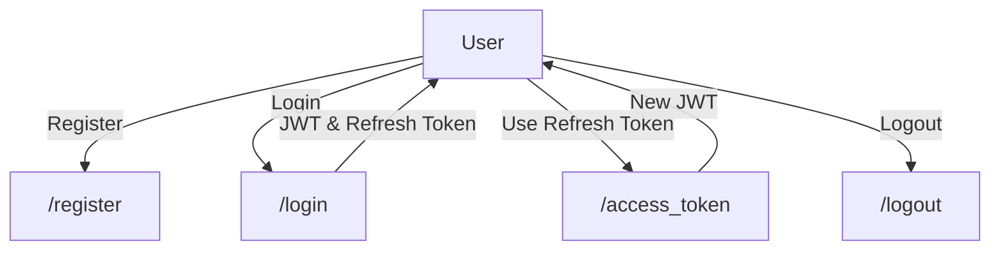
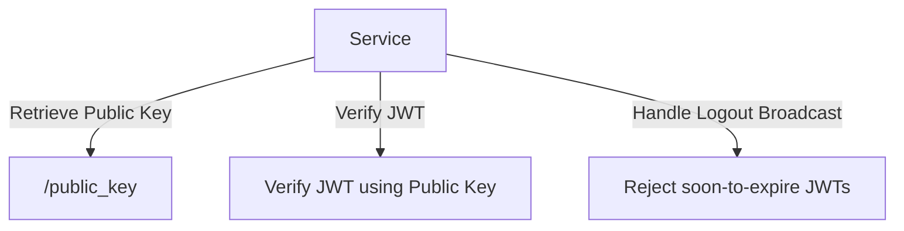

# Authix: Scalable Authentication Service

Welcome to **Authix**, an authentication service designed based on a [talk by
Brian Pontarelli](https://www.youtube.com/watch?v=SLc3cTlypwM).

Authix provides a comprehensive solution for user authentication, built on the
principles of JWT (pronounced 'jot') and refresh tokens.

## Key Features

1. **User Registration**: Users can sign up using their email and password.
   Users are stored in MongoDB.

2. **User Login**: Upon successful login, users receive:

   - A JWT access token in the Authorization header for immediate access.
   - A longer-lived refresh token as an HTTP cookie for extended sessions.

3. **Access Token Management**: Generate new JWT access tokens using the
   provided refresh token, ensuring seamless user experiences.

4. **Public Key**: Services can verify JWTs independently via public key,
   thereby reducing inter-service network calls.

5. **Secure Logout**: Users are logged out by deleting their refresh token from
   storage, which thereby removes the possibility to create new access tokens.
   Furthermore, it informs all connected services via Kafka to reject JWTs from
   the logged-out user, that have been created prior to logging out.

6. **Token Lifespan**:
   - JWT access tokens are valid for 5 minutes.
   - Refresh tokens, stored in REDIS, last for 4 weeks.

## Diagrams

### User Perspective

### Service Perspective

## Performance

On a single computer, running Authix via uvicorn with 16 workers, expect it to
handle ~1600 `/register` events/second. This could be scaled up easily by
running more nodes, since the bottleneck is the password hashing and
verification.
